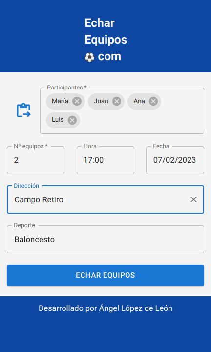

<!-- PROJECT LOGO -->
 

<a href="HTML-url">![HTML][HTML]</a>	
<a href="CSS-url">![CSS][CSS]</a>
<a href="javascript-url">![javascript][javascript]</a>
<a href="MUI-url">![MUI][MUI]</a>
<a href="React.js-url">![React.js][React.js]</a>

  <h2 align="center">echar_equipos</h2>
  
  

    Un proyecto de interfaz sencilla y funcionalidad particular.
     
    <a href="https://github.com/angellopezdeleon/project_echarequipos"><strong>Explora el código »</strong></a>
     
     
    <a href="https://echarequipos-4sgb.vercel.app/">Mira cómo se ve</a>
    ·
    <a href="https://github.com/angellopezdeleon/project_echarequipos/issues">Reporta problemas</a>
  

<!-- ABOUT THE PROJECT -->
## Sobre el proyecto

La idea es tratar de mejorar a nivel usabilidad las aplicaciónes que existen en el mercado para realizar un sorteo de equipos.
Por otro lado, me ha valido para crear una aplicación con React usando un sistema de diseño Material Design con la librería Material UI.

  

<!-- CONTACT -->
## Contacto

Ángel López de León - angel.lopjar@gmail.com - [![LinkedIn][linkedin-shield]][linkedin-url]

Project Link: [https://github.com/angellopezdeleon/project_echarequipos](https://github.com/angellopezdeleon/project_echarequipos)

<!-- MARKDOWN LINKS & IMAGES -->
<!-- https://www.markdownguide.org/basic-syntax/#reference-style-links -->
[linkedin-shield]: https://img.shields.io/badge/-LinkedIn-black.svg?style=for-the-badge&logo=linkedin&colorB=555
[linkedin-url]: www.linkedin.com/in/angel-lopez-de-leon-jaramillo
[product-screenshot]: public/echar1.png
[HTML]: https://img.shields.io/badge/HTML-orange?style=for-the-badge&logo=html5&logoColor=white
[HTML-url]: https://developer.mozilla.org/es/docs/Web/HTML
[CSS]: https://img.shields.io/badge/CSS-blue?style=for-the-badge&logo=css3&logoColor=white
[CSS-url]: https://developer.mozilla.org/es/docs/Web/CSS
[React.js]: https://img.shields.io/badge/React-20232A?style=for-the-badge&logo=react&logoColor=61DAFB
[React-url]: https://reactjs.org/
[MUI]: https://img.shields.io/badge/MUI-blue?style=for-the-badge&logo=MUI&logoColor=61DAFB
[MUI-url]: https://mui.com/
[javascript]: https://img.shields.io/badge/javascript-yellow?style=for-the-badge&logo=javascript&logoColor=white
[javascript-url]: https://vincentgarreau.com/particles.js/
